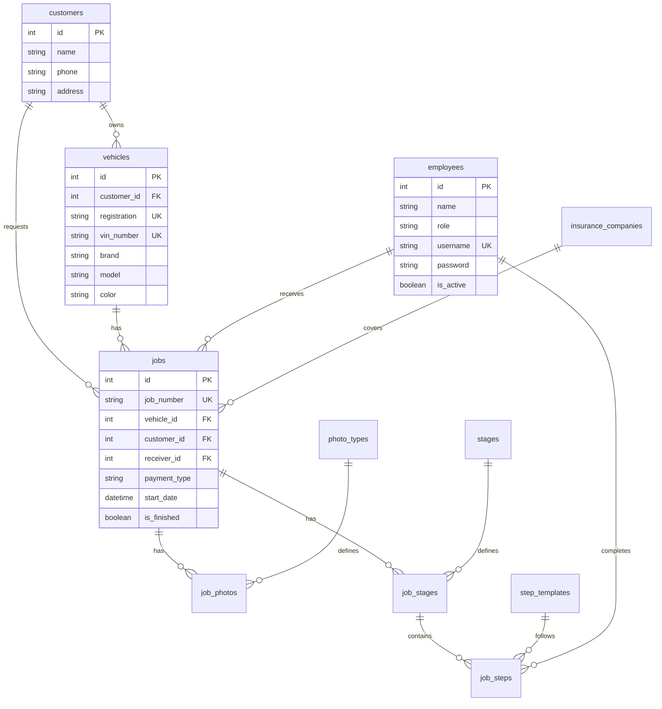

# 🚗 SP Auto Service - Backend API

A high-performance RESTful API backend for **บริษัท เอส.พี.ออโต้เพ้นท์ เซอร์วิส จำกัด** (SP Auto Paint Service Co., Ltd.), a car repair and paint shop management system.

Built with modern technologies for speed, type-safety, and edge deployment.

## 🛠️ Tech Stack

| Technology                         | Purpose                              |
| ---------------------------------- | ------------------------------------ |
| [Bun](https://bun.sh)              | JavaScript runtime & package manager |
| [Hono](https://hono.dev)           | Ultrafast web framework              |
| [Prisma](https://prisma.io)        | Type-safe ORM                        |
| [SQLite/Turso](https://turso.tech) | Edge-ready database                  |
| [Swagger UI](https://swagger.io)   | API documentation                    |

---

## 📐 Architecture Overview

```mermaid
flowchart TB
    subgraph Client["🌐 Client Layer"]
        Mobile["📱 Mobile App"]
        Web["💻 Web App"]
        Swagger["📋 Swagger UI"]
    end

    subgraph API["🔌 API Layer (Hono)"]
        Auth["🔐 Auth Routes"]
        Private["🔒 Private API Routes"]
        Public["🌍 Public Routes"]
    end

    subgraph Middleware["⚙️ Middleware"]
        CORS["CORS"]
        Logger["Logger"]
        Compress["Compression"]
        SecureHeaders["Secure Headers"]
        JWT["JWT Auth"]
    end

    subgraph Controllers["📦 Controllers"]
        AuthCtrl["Auth Controller"]
        EmpCtrl["Employee Controller"]
        CustCtrl["Customer Controller"]
        VehCtrl["Vehicle Controller"]
        JobCtrl["Job Controller"]
    end

    subgraph Services["🔧 Services"]
        AuthSvc["Auth Service"]
        EmpSvc["Employee Service"]
        CustSvc["Customer Service"]
        VehSvc["Vehicle Service"]
        JobSvc["Job Service"]
    end

    subgraph Database["🗄️ Database Layer"]
        Prisma["Prisma ORM"]
        SQLite["SQLite / Turso"]
    end

    Client --> API
    API --> Middleware
    Middleware --> Controllers
    Controllers --> Services
    Services --> Prisma
    Prisma --> SQLite
```



---

## 🗄️ Database Schema



---

## 📁 Project Structure

```
be-sp-auto/
├── 📂 src/
│   ├── 📂 controllers/     # Request handlers
│   │   ├── auth.controller.ts
│   │   ├── customer.controller.ts
│   │   ├── employee.controller.ts
│   │   ├── job.controller.ts
│   │   └── vehicle.controller.ts
│   ├── 📂 services/        # Business logic
│   │   ├── auth.service.ts
│   │   ├── customer.service.ts
│   │   ├── employee.service.ts
│   │   ├── job.service.ts
│   │   └── vehicle.service.ts
│   ├── 📂 routes/          # API route definitions
│   │   ├── customer.routes.ts
│   │   ├── employee.routes.ts
│   │   ├── job.routes.ts
│   │   └── vehicle.routes.ts
│   ├── 📂 middleware/      # Auth & other middleware
│   │   └── auth.middleware.ts
│   ├── 📂 lib/             # Utilities (Prisma client)
│   ├── 📂 tests/           # Test suites
│   ├── index.ts            # App entry point
│   └── swagger.ts          # Swagger configuration
├── 📂 prisma/
│   ├── schema.prisma       # Database schema
│   ├── seed.ts             # Seed data
│   └── 📂 migrations/      # Database migrations
├── 📂 database/
│   ├── schema.sql          # MySQL schema
│   ├── schema.turso.sql    # Turso/SQLite schema
│   └── schema.dbml         # DBML for dbdiagram.io
├── .env                    # Environment variables
├── package.json
└── tsconfig.json
```

---

## 🚀 Getting Started

### Prerequisites

- [Bun](https://bun.sh) v1.3.3 or higher

### Installation

```bash
# Clone the repository
git clone <repository-url>
cd be-sp-auto

# Install dependencies
bun install

# Set up environment variables
cp .env.example .env
# Edit .env with your database URL
```

### Database Setup

```bash
# Generate Prisma client
bunx prisma generate

# Run migrations
bunx prisma migrate dev

# Seed the database
bunx prisma db seed
```

### Running the Server

```bash
# Development (with hot reload)
bun run dev

# Production
bun run src/index.ts
```

The server starts at `http://localhost:8080`

---

## 📚 API Documentation

### Interactive Docs

Access Swagger UI at: **http://localhost:8080/ui**

### API Endpoints Overview

| Method             | Endpoint               | Description                    | Auth |
| ------------------ | ---------------------- | ------------------------------ | ---- |
| **Authentication** |                        |                                |      |
| `POST`             | `/auth/login`          | User login                     | ❌   |
| `POST`             | `/auth/logout`         | User logout                    | ✅   |
| **Employees**      |                        |                                |      |
| `GET`              | `/api/employees`       | List all employees (paginated) | ✅   |
| `GET`              | `/api/employees/:id`   | Get employee by ID             | ✅   |
| `POST`             | `/api/employees`       | Create employee                | ✅   |
| `PUT`              | `/api/employees/:id`   | Update employee                | ✅   |
| `DELETE`           | `/api/employees/:id`   | Delete employee                | ✅   |
| **Customers**      |                        |                                |      |
| `GET`              | `/api/customers`       | List all customers (paginated) | ✅   |
| `GET`              | `/api/customers/:id`   | Get customer by ID             | ✅   |
| `POST`             | `/api/customers`       | Create customer                | ✅   |
| `PUT`              | `/api/customers/:id`   | Update customer                | ✅   |
| `DELETE`           | `/api/customers/:id`   | Delete customer                | ✅   |
| **Vehicles**       |                        |                                |      |
| `GET`              | `/api/vehicles`        | List all vehicles (paginated)  | ✅   |
| `GET`              | `/api/vehicles/:id`    | Get vehicle by ID              | ✅   |
| `GET`              | `/api/vehicles/brands` | List all vehicle brands        | ❌   |
| `POST`             | `/api/vehicles`        | Create vehicle                 | ✅   |
| `PUT`              | `/api/vehicles/:id`    | Update vehicle                 | ✅   |
| `DELETE`           | `/api/vehicles/:id`    | Delete vehicle                 | ✅   |
| **Jobs**           |                        |                                |      |
| `GET`              | `/api/jobs`            | List all jobs (paginated)      | ✅   |
| `GET`              | `/api/jobs/:id`        | Get job by ID                  | ✅   |
| `POST`             | `/api/jobs`            | Create job                     | ✅   |
| `PUT`              | `/api/jobs/:id`        | Update job                     | ✅   |
| `DELETE`           | `/api/jobs/:id`        | Delete job                     | ✅   |
| **Utility**        |                        |                                |      |
| `GET`              | `/health`              | Health check                   | ❌   |
| `GET`              | `/doc`                 | OpenAPI JSON spec              | ❌   |

### Pagination

All list endpoints support pagination:

```
GET /api/employees?page=1&limit=10
```

**Response:**

```json
{
  "data": [...],
  "total": 100,
  "page": 1,
  "limit": 10,
  "totalPages": 10
}
```

### Authentication

Protected endpoints require a JWT token in the Authorization header:

```
Authorization: Bearer <token>
```

---

## 🔄 Workflow Overview

The system manages car repair jobs through 3 main stages:

```mermaid
flowchart LR
    subgraph Stage1["1️⃣ เคลม (Claim)"]
        C1[ยื่นเคลม]
        C2[เช็ครายการ]
        C3[ขอ/เสนอราคา]
        C4[อนุมัติ]
        C5[หาอะไหล่]
        C6[นัดคิวเข้า]
    end

    subgraph Stage2["2️⃣ ซ่อม (Repair)"]
        R1[รื้อ/ถอด]
        R2[เคาะ]
        R3[โป้วสี]
        R4[พ่นสี]
        R5[ประกอบ]
        R6[ขัดสี]
        R7[QC]
    end

    subgraph Stage3["3️⃣ ตั้งเบิก (Billing)"]
        B1[เรียงรูป]
        B2[ส่งอนุมัติ]
        B3[ออกใบกำกับ]
        B4[นำเรื่องตั้งเบิก]
        B5[วันจ่ายเงิน]
    end

    Stage1 --> Stage2 --> Stage3
```



---

## 🧪 Testing

```bash
# Run all tests
bun test

# Run specific test file
bun test src/tests/auth.test.ts

# Run with watch mode
bun test --watch
```

### Test Coverage

- ✅ Authentication (login/logout)
- ✅ Employee CRUD operations
- ✅ Customer CRUD operations
- ✅ Vehicle CRUD operations
- ✅ Job CRUD operations
- ✅ Delete operations validation
- ✅ Workflow progression

---

## 🔐 Environment Variables

Create a `.env` file in the root directory:

```env
# Database
TURSO_DATABASE_URL=libsql://your-database.turso.io
TURSO_AUTH_TOKEN=your-auth-token

# JWT
JWT_SECRET=your-secret-key
```

---

## 📊 Database Visualization

Import the DBML schema into [dbdiagram.io](https://dbdiagram.io):

```bash
# The schema file is located at:
database/schema.dbml
```

---

## 🤝 Contributing

1. Fork the repository
2. Create your feature branch (`git checkout -b feature/amazing-feature`)
3. Commit your changes (`git commit -m 'Add some amazing feature'`)
4. Push to the branch (`git push origin feature/amazing-feature`)
5. Open a Pull Request

---

## 📝 License

This project is proprietary software for SP Auto Paint Service Co., Ltd.

---

## 📞 Support

For technical support, please contact the development team.

---

<p align="center">
  <strong>Built with ❤️ for SP Auto Service</strong><br>
  <em>Powered by Bun + Hono + Prisma</em>
</p>
