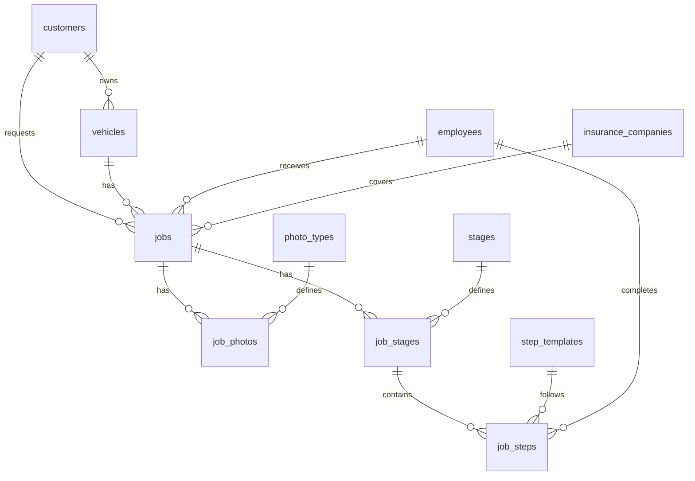

# SP Auto Service Database Schema

ระบบฐานข้อมูลสำหรับอู่ซ่อมรถ **บริษัท เอส.พี.ออโต้เพ้นท์ เซอร์วิส จำกัด**

## 📁 Files

| File | Description |
|------|-------------|
| `schema.sql` | MySQL 8.0+ |
| `schema.turso.sql` | Turso (SQLite/libSQL) |
| `schema.dbml` | [dbdiagram.io](https://dbdiagram.io) import |

---

## 📊 Entity Relationship Diagram



---

## 🗂️ Tables

### Reference Tables

| Table | Description |
|-------|-------------|
| `employees` | พนักงาน (Staff members) |
| `insurance_companies` | บริษัทประกันภัย |
| `photo_types` | ช่างรูป (8 types) |

### Core Tables

| Table | Description |
|-------|-------------|
| `customers` | ข้อมูลลูกค้า |
| `vehicles` | ข้อมูลรถ (ทะเบียน, เลขถัง, ยี่ห้อ, รุ่น, สี) |

### Workflow Tables

| Table | Description |
|-------|-------------|
| `stages` | 3 ขั้นตอนหลัก: เคลม, ซ่อม, ตั้งเบิก |
| `step_templates` | 32 รายการย่อย |

### Job Tracking Tables

| Table | Description |
|-------|-------------|
| `jobs` | ใบปฏิบัติงาน (Main job order) |
| `job_photos` | สถานะรูปถ่ายแต่ละงาน |
| `job_stages` | สถานะขั้นตอนแต่ละงาน |
| `job_steps` | สถานะรายการย่อยแต่ละงาน |

---

## 📋 Workflow Steps

### 1. เคลม (Claim) - 13 ขั้นตอน

| # | Step |
|---|------|
| 1 | ยื่นเคลม |
| 2 | เช็ครายการ |
| 3 | ขอราคา |
| 4 | เสนอราคา |
| 5 | ส่งประกัน |
| 6 | อนุมัติ |
| 7 | หาอะไหล่ |
| 8 | สั่งอะไหล่ |
| 9 | อะไหล่ครบ |
| 10 | นัดคิวเข้า |
| 11 | ลูกค้าเข้าจอด |
| 12 | เสนอเพิ่ม |
| 13 | รถเสร็จ |

### 2. ซ่อม (Repair) - 11 ขั้นตอน *(ข้ามได้)*

| # | Step |
|---|------|
| 1 | รื้อ/ถอด |
| 2 | เคาะ |
| 3 | เคาะ เบิกอะไหล่ |
| 4 | โป้วสี |
| 5 | พ่นสีพื้น |
| 6 | พ่นสีจริง |
| 7 | ประกอบเบิกอะไหล่ |
| 8 | ขัดสี |
| 9 | ล้างรถ |
| 10 | QC |
| 11 | ลูกค้ารับรถ |

### 3. ตั้งเบิก (Billing) - 8 ขั้นตอน

| # | Step |
|---|------|
| 1 | รถเสร็จ |
| 2 | เรียงรูป |
| 3 | ส่งอนุมัติ |
| 4 | อนุมัติเสร็จ |
| 5 | ออกใบกำกับภาษี |
| 6 | เรียงเรื่อง |
| 7 | นำเรื่องตั้งเบิก |
| 8 | วันจ่ายเงิน |

---

## 📸 Photo Types (ช่างรูป)

| Code | Name |
|------|------|
| `before_repair` | ก่อนซ่อม |
| `dent` | เคาะ |
| `putty` | โป้วสี |
| `primer` | พ่นสีพื้น |
| `paint` | พ่นสีจริง |
| `parts` | เกี่ยวอะไหล่ |
| `polish` | ขัดสี |
| `completed` | รถเสร็จ |

---

## 🚀 Usage

### MySQL
```bash
mysql -u root -p < database/schema.sql
```

### Turso
```bash
turso db shell your-db-name < database/schema.turso.sql
```

### dbdiagram.io
1. Go to [dbdiagram.io](https://dbdiagram.io)
2. Import → DBML
3. Paste content from `schema.dbml`

---

## 📊 Views

| View | Description |
|------|-------------|
| `v_job_statistics` | Dashboard stats (total, claim, repair, billing, finished) |
| `v_job_details` | Full job info with joins |
| `v_job_progress` | Step completion per stage |

---

## 🔧 Stored Procedures (MySQL only)

| Procedure | Description |
|-----------|-------------|
| `sp_create_job()` | Create new job with all stages/steps |
| `sp_update_step()` | Update step status |
| `sp_complete_stage()` | Complete stage and unlock next |
