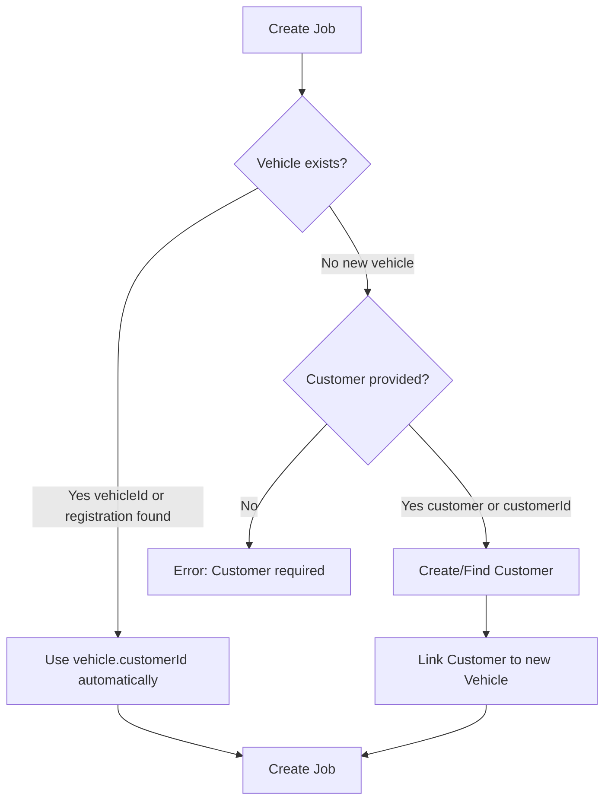
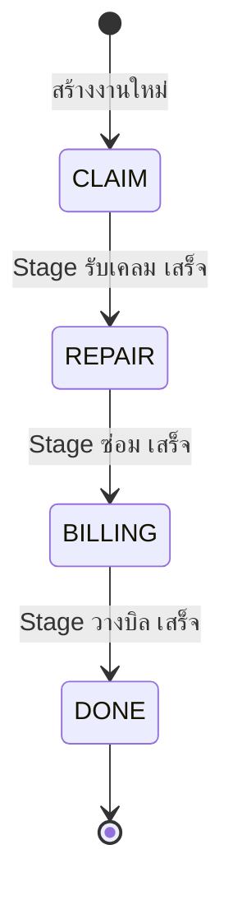

# Jobs Endpoint - Payload Documentation

> API Base: `/api/v1/private/jobs`

---

## Table of Contents
- [POST /jobs - Create Job](#post-jobs---create-job)
- [GET /jobs - List Jobs](#get-jobs---list-jobs)
- [GET /jobs/:id - Get Job Details](#get-jobsid---get-job-details)
- [PATCH /jobs/steps/:stepId - Update Step Status](#patch-jobsstepsstepid---update-step-status)

---

## POST /jobs - Create Job

> [!IMPORTANT]
> **Customer Resolution Logic:**
> - **รถมีอยู่แล้ว** → ระบบจะใช้ `customer` จาก `vehicle.customerId` **อัตโนมัติ** (ไม่ต้องระบุ customer)
> - **รถใหม่** → **ต้องระบุ** `customer` หรือ `customerId` (บังคับ) และจะ link กับรถใหม่ให้อัตโนมัติ
> - ถ้าส่งทั้ง `customerId` และ `customer` → ระบบจะใช้ `customerId` และ **ignore** `customer`
> 
> **Vehicle Resolution Logic:**
> - ถ้ามีทั้ง `vehicleId` และ `vehicle` → ระบบจะใช้ `vehicleId` และ **ignore** `vehicle` ทั้งก้อน
> - ถ้าใช้ `vehicle.registration` แล้วเจอรถในระบบ → จะใช้รถเดิมและ **ignore** ค่า `vehicle.brand/model/color/...`

### ✅ Payload Keys (Create Job)

| Key | Type | Required | รายละเอียด (TH) |
|---|---|---|---|
| `startDate` | string (date-time) | ✅ | วันที่เริ่มงาน (ต้องส่งเสมอ) |
| `jobNumber` | string | Optional | เลขที่งาน ถ้าไม่ส่งระบบจะ generate อัตโนมัติ |
| `vehicleId` | integer | Conditional | ใช้เมื่ออ้างอิงรถเดิม (เลือกส่งอย่างใดอย่างหนึ่งกับ `vehicle`) |
| `vehicle` | object | Conditional | ส่งข้อมูลรถในคำขอ (เลือกส่งอย่างใดอย่างหนึ่งกับ `vehicleId`) |
| `customerId` | integer | Conditional | ระบุลูกค้าเดิม (เลือกส่งอย่างใดอย่างหนึ่งกับ `customer`) |
| `customer` | object | Conditional | ส่งข้อมูลลูกค้าใหม่/ค้นหา (เลือกส่งอย่างใดอย่างหนึ่งกับ `customerId`) |
| `insuranceCompanyId` | integer | Optional | บริษัทประกันที่เกี่ยวข้อง |
| `paymentType` | string | Optional | ประเภทการชำระเงิน เช่น `Insurance` หรือ `Cash` |
| `excessFee` | number | Optional | ค่าเสียหายส่วนแรก (Deductible) |
| `estimatedEndDate` | string (date-time) | Optional | วันที่คาดว่าจะเสร็จ |
| `repairDescription` | string | Optional | รายละเอียดงานซ่อม |
| `notes` | string | Optional | หมายเหตุเพิ่มเติม |

> [!NOTE]
> เงื่อนไขสำคัญ:
> - ต้องมีอย่างใดอย่างหนึ่ง: `vehicleId` หรือ `vehicle`
> - ถ้ารถใหม่ (ไม่พบทะเบียน) ต้องมีอย่างใดอย่างหนึ่ง: `customerId` หรือ `customer`
> - ถ้าส่งทั้ง `vehicleId` และ `vehicle` → ใช้ `vehicleId`
> - ถ้าส่งทั้ง `customerId` และ `customer` → ใช้ `customerId`

#### 📌 `vehicle` object

| Key | Type | Required | รายละเอียด (TH) |
|---|---|---|---|
| `registration` | string | ✅ | ทะเบียนรถ (ใช้ค้นหา/สร้างรถใหม่) |
| `brand` | string | ✅ (เฉพาะรถใหม่) | ยี่ห้อรถ |
| `model` | string | Optional | รุ่นรถ |
| `color` | string | Optional | สีรถ |
| `vinNumber` | string | Optional | VIN |
| `chassisNumber` | string | Optional | เลขตัวถัง |

#### 📌 `customer` object

| Key | Type | Required | รายละเอียด (TH) |
|---|---|---|---|
| `name` | string | ✅ | ชื่อลูกค้า |
| `phone` | string | Optional | เบอร์โทร (ใช้คู่ `name` เพื่อค้นหาลูกค้าเดิม) |
| `address` | string | Optional | ที่อยู่ |

---

### 📌 Scenario 1: Existing Vehicle (Simplest - Recommended)

**Use Case:** รถมีอยู่ในระบบแล้ว → Customer ถูกดึงจาก Vehicle อัตโนมัติ

```json
{
  "vehicleId": 1,
  "startDate": "2026-01-22T00:00:00.000Z"
}
```

> [!TIP]
> ไม่ต้องระบุ `customerId` เพราะระบบจะดึงจาก `vehicle.customerId` ให้อัตโนมัติ

---

### 📌 Scenario 2: Existing Vehicle by Registration Lookup

**Use Case:** รถมีอยู่แล้ว ใช้ทะเบียนในการ lookup

```json
{
  "vehicle": {
    "registration": "1กก 1234"
  },
  "startDate": "2026-01-22T00:00:00.000Z"
}
```

> [!NOTE]
> ถ้าเจอทะเบียนในระบบ → ใช้ customer จาก vehicle นั้นโดยอัตโนมัติ

---

### 📌 Scenario 2.1: Existing Vehicle (No Customer) + Provide Customer

**Use Case:** รถมีอยู่แล้วแต่ยังไม่มี customer → ระบุ `customerId` หรือ `customer`

```json
{
  "vehicle": {
    "registration": "1กก 1234"
  },
  "customerId": 5,
  "startDate": "2026-01-22T00:00:00.000Z"
}
```

> [!NOTE]
> - ใช้ customer ตามที่ส่งมา (เพราะรถเดิมไม่มี customer)
> - **ไม่** link customer กลับไปที่ vehicle อัตโนมัติ (เฉพาะรถใหม่เท่านั้น)

---

### 📌 Scenario 3: Existing Vehicle with Custom Job Number

**Use Case:** รถมีอยู่แล้ว + ระบุเลขที่งานเอง (เช่น เลข Claim)

```json
{
  "jobNumber": "CLM-2026-001234",
  "vehicleId": 1,
  "startDate": "2026-01-22T00:00:00.000Z"
}
```

---

### 📌 Scenario 4: Existing Vehicle with Insurance & Full Details

**Use Case:** งานเคลมประกันจากรถที่มีอยู่

```json
{
  "jobNumber": "INS-2026-00789",
  "vehicleId": 1,
  "insuranceCompanyId": 3,
  "paymentType": "Insurance",
  "excessFee": 2500.00,
  "startDate": "2026-01-22T00:00:00.000Z",
  "estimatedEndDate": "2026-01-29T00:00:00.000Z",
  "repairDescription": "ซ่อมฝากระโปรงหน้า ทำสี กันชนหน้า",
  "notes": "ลูกค้าขอรับรถภายในวันศุกร์"
}
```

---

### 📌 Scenario 5: New Vehicle + New Customer (Walk-in)

**Use Case:** ลูกค้าใหม่มาพร้อมรถใหม่ที่ไม่มีในระบบ

```json
{
  "vehicle": {
    "registration": "กข 9999",
    "brand": "Honda",
    "model": "City",
    "color": "ดำ"
  },
  "customer": {
    "name": "สมหญิง รักสวย",
    "phone": "0987654321",
    "address": "123 ถนนสุขุมวิท"
  },
  "startDate": "2026-01-22T00:00:00.000Z",
  "paymentType": "Cash",
  "repairDescription": "ขัดเคลือบสี"
}
```

> [!NOTE]
> - สร้าง Vehicle ใหม่
> - สร้าง Customer ใหม่ (หรือใช้ที่มีอยู่ถ้า name+phone ตรงกัน)
> - **Link customer กับ vehicle ให้อัตโนมัติ**

---

### 📌 Scenario 6: New Vehicle + Existing Customer

**Use Case:** ลูกค้าเดิมมีรถใหม่

```json
{
  "vehicle": {
    "registration": "ขข 5555",
    "brand": "Toyota",
    "model": "Camry"
  },
  "customerId": 5,
  "startDate": "2026-01-22T00:00:00.000Z"
}
```

> [!NOTE]
> - สร้าง Vehicle ใหม่
> - ใช้ Customer ที่มี ID = 5
> - **Link customer กับ vehicle ใหม่ให้อัตโนมัติ**

---

### 📌 Scenario 7: New Vehicle with Full Details (Insurance Claim)

**Use Case:** รถใหม่ ลูกค้าใหม่ งานเคลมประกัน

```json
{
  "jobNumber": "VIR-2026-001",
  "vehicle": {
    "registration": "2ขข 5678",
    "brand": "Mazda",
    "model": "CX-5",
    "color": "แดง Soul Red",
    "vinNumber": "JM3KE2CY5K0654321",
    "chassisNumber": "MAZDA654321"
  },
  "customer": {
    "name": "วิรัตน์ สุขสมบูรณ์",
    "phone": "0891234567",
    "address": "456 ซอยลาดพร้าว 87 กรุงเทพฯ"
  },
  "insuranceCompanyId": 2,
  "paymentType": "Insurance",
  "excessFee": 1500.00,
  "startDate": "2026-01-22T09:00:00.000Z",
  "estimatedEndDate": "2026-02-05T17:00:00.000Z",
  "repairDescription": "ชนท้าย: ซ่อมฝาท้าย กันชนหลัง ไฟท้ายซ้าย ทำสีทั้งคัน",
  "notes": "รถใหม่ไม่เกิน 1 ปี ต้องใช้อะไหล่แท้ทั้งหมด"
}
```

---

## Decision Tree



---

## ❌ Error Scenarios

### Missing Vehicle Data

```json
{
  "startDate": "2026-01-22T00:00:00.000Z"
}
```

**Response:** `400 Bad Request`
```json
{
  "error": "Failed to create job",
  "details": "Error: Either vehicleId or vehicle object is required"
}
```

---

### Missing Vehicle Registration for New Vehicle

```json
{
  "vehicle": {
    "brand": "Toyota"
  },
  "startDate": "2026-01-22T00:00:00.000Z"
}
```

**Response:** `400 Bad Request`
```json
{
  "error": "Failed to create job",
  "details": "Error: Vehicle registration is required"
}
```

---

### Missing Brand for New Vehicle

```json
{
  "vehicle": {
    "registration": "ทะเบียนใหม่ไม่มีในระบบ"
  },
  "startDate": "2026-01-22T00:00:00.000Z"
}
```

**Response:** `400 Bad Request`
```json
{
  "error": "Failed to create job",
  "details": "Error: Vehicle brand is required for new vehicles"
}
```

---

### Invalid Vehicle ID

```json
{
  "vehicleId": 99999,
  "startDate": "2026-01-22T00:00:00.000Z"
}
```

**Response:** `400 Bad Request`
```json
{
  "error": "Failed to create job",
  "details": "Error: Vehicle not found"
}
```

---

### New Vehicle without Customer

```json
{
  "vehicle": {
    "registration": "กก 1111",
    "brand": "Nissan"
  },
  "startDate": "2026-01-22T00:00:00.000Z"
}
```

**Response:** `400 Bad Request`
```json
{
  "error": "Failed to create job",
  "details": "Error: Customer is required when creating a new vehicle"
}
```

---

### Invalid Customer ID

```json
{
  "vehicleId": 1,
  "customerId": 99999,
  "startDate": "2026-01-22T00:00:00.000Z"
}
```

**Response:** `400 Bad Request`
```json
{
  "error": "Failed to create job",
  "details": "Error: Customer not found"
}
```

---

### Missing Start Date

```json
{
  "vehicleId": 1
}
```

**Response:** `400 Bad Request`
```json
{
  "error": "Failed to create job",
  "details": "Error: PrismaClientValidationError: ... startDate ..."
}
```

## GET /jobs - List Jobs

### Query Parameters

| Parameter | Type | Description |
|-----------|------|-------------|
| `page` | integer | หน้าที่ต้องการ (default: 1) |
| `limit` | integer | จำนวนต่อหน้า (default: 10) |
| `status` | string | `CLAIM` / `REPAIR` / `BILLING` / `DONE` |
| `search` | string | ค้นหาจาก: ทะเบียน, VIN, Chassis, ชื่อลูกค้า, เลขที่งาน |
| `vehicleRegistration` | string | ค้นหาจากทะเบียนรถ (alias: `registration`) |
| `customerName` | string | ค้นหาจากชื่อลูกค้า (alias: `customer`) |
| `chassisNumber` | string | ค้นหาจากเลขตัวถัง (alias: `chassis`) |
| `vinNumber` | string | ค้นหาจาก VIN (alias: `vin`) |
| `jobNumber` | string | ค้นหาจากเลขที่งาน |
| `insuranceCompanyId` | integer | กรองตามบริษัทประกัน |
| `startDateFrom` | date | งานที่เริ่มตั้งแต่วันที่ |
| `startDateTo` | date | งานที่เริ่มถึงวันที่ |
| `sortBy` | string | เรียงตาม: `jobNumber`, `startDate`, `status`, `createdAt`, `updatedAt`, `estimatedEndDate`, `actualEndDate` (invalid → fallback `createdAt`) |
| `sortOrder` | string | `asc` / `desc` (default: desc) |

### Request Examples

#### Default (Latest Jobs)
```
GET /api/v1/private/jobs
```

#### Filter by Status
```
GET /api/v1/private/jobs?status=REPAIR
```

#### Search All Fields
```
GET /api/v1/private/jobs?search=กก1234
```

#### Complex Filter
```
GET /api/v1/private/jobs?status=CLAIM&insuranceCompanyId=3&startDateFrom=2026-01-01&startDateTo=2026-01-31&sortBy=startDate&sortOrder=asc
```

### Response Example

```json
{
  "data": [
    {
      "id": 1,
      "jobNumber": "JOB-M1A2B3C4",
      "vehicleId": 5,
      "customerId": 3,
      "insuranceCompanyId": 2,
      "status": "REPAIR",
      "paymentType": "Insurance",
      "excessFee": 2500,
      "startDate": "2026-01-22T00:00:00.000Z",
      "estimatedEndDate": "2026-01-29T00:00:00.000Z",
      "actualEndDate": null,
      "repairDescription": "ซ่อมฝากระโปรงหน้า",
      "notes": null,
      "createdAt": "2026-01-22T03:30:00.000Z",
      "updatedAt": "2026-01-22T03:30:00.000Z",
      "vehicle": {
        "id": 5,
        "registration": "1กก 1234",
        "brand": "Toyota",
        "model": "Camry",
        "color": "ขาว",
        "vinNumber": "JTDKN3DU5A0123456",
        "chassisNumber": "CH123456789"
      },
      "customer": {
        "id": 3,
        "name": "สมชาย ใจดี",
        "phone": "0812345678"
      },
      "insuranceCompany": {
        "id": 2,
        "name": "วิริยะประกันภัย"
      }
    }
  ],
  "total": 25,
  "page": 1,
  "limit": 10,
  "totalPages": 3,
  "statusCounts": {
    "all": 25,
    "CLAIM": 5,
    "REPAIR": 12,
    "BILLING": 3,
    "DONE": 5
  }
}
```

---

## GET /jobs/:id - Get Job Details

### Request
```
GET /api/v1/private/jobs/1
```

### Response Example

```json
{
  "id": 1,
  "jobNumber": "JOB-M1A2B3C4",
  "vehicleId": 5,
  "customerId": 3,
  "insuranceCompanyId": 2,
  "status": "REPAIR",
  "paymentType": "Insurance",
  "excessFee": 2500,
  "startDate": "2026-01-22T00:00:00.000Z",
  "estimatedEndDate": "2026-01-29T00:00:00.000Z",
  "actualEndDate": null,
  "repairDescription": "ซ่อมฝากระโปรงหน้า",
  "notes": "ลูกค้าขอรับรถภายในวันศุกร์",
  "createdAt": "2026-01-22T03:30:00.000Z",
  "updatedAt": "2026-01-22T03:30:00.000Z",
  "vehicle": {
    "id": 5,
    "registration": "1กก 1234",
    "brand": "Toyota",
    "model": "Camry",
    "color": "ขาว",
    "vinNumber": "JTDKN3DU5A0123456",
    "chassisNumber": "CH123456789",
    "customerId": 3,
    "createdAt": "2026-01-20T00:00:00.000Z",
    "updatedAt": "2026-01-20T00:00:00.000Z"
  },
  "customer": {
    "id": 3,
    "name": "สมชาย ใจดี",
    "phone": "0812345678",
    "address": "123 ถนนสุขุมวิท",
    "createdAt": "2026-01-15T00:00:00.000Z",
    "updatedAt": "2026-01-15T00:00:00.000Z"
  },
  "insuranceCompany": {
    "id": 2,
    "name": "วิริยะประกันภัย",
    "code": "VIRIYAH",
    "contactEmail": "claim@viriyah.co.th",
    "contactPhone": "020000000"
  },
  "jobStages": [
    {
      "id": 1,
      "jobId": 1,
      "stageId": 1,
      "isLocked": false,
      "isCompleted": true,
      "startedAt": "2026-01-22T03:30:00.000Z",
      "completedAt": "2026-01-22T10:00:00.000Z",
      "stage": {
        "id": 1,
        "code": "CLAIM",
        "name": "รับเคลม",
        "orderIndex": 1
      },
      "jobSteps": [
        {
          "id": 1,
          "jobStageId": 1,
          "stepTemplateId": 1,
          "status": "completed",
          "employeeId": 1,
          "completedAt": "2026-01-22T09:00:00.000Z",
          "stepTemplate": {
            "id": 1,
            "stageId": 1,
            "name": "ตรวจรับรถ",
            "isSkippable": false,
            "orderIndex": 1
          },
          "employee": {
            "id": 1,
            "name": "พนักงาน A",
            "role": "TECHNICIAN"
          }
        },
        {
          "id": 2,
          "jobStageId": 1,
          "stepTemplateId": 2,
          "status": "completed",
          "employeeId": 2,
          "completedAt": "2026-01-22T10:00:00.000Z",
          "stepTemplate": {
            "id": 2,
            "stageId": 1,
            "name": "ประเมินราคา",
            "isSkippable": false,
            "orderIndex": 2
          },
          "employee": {
            "id": 2,
            "name": "พนักงาน B",
            "role": "ESTIMATOR"
          }
        }
      ]
    },
    {
      "id": 2,
      "jobId": 1,
      "stageId": 2,
      "isLocked": false,
      "isCompleted": false,
      "startedAt": "2026-01-22T10:00:00.000Z",
      "completedAt": null,
      "stage": {
        "id": 2,
        "code": "REPAIR",
        "name": "ซ่อม",
        "orderIndex": 2
      },
      "jobSteps": [
        {
          "id": 3,
          "jobStageId": 2,
          "stepTemplateId": 3,
          "status": "in_progress",
          "employeeId": 3,
          "completedAt": null,
          "stepTemplate": {
            "id": 3,
            "stageId": 2,
            "name": "ถอดชิ้นส่วน",
            "isSkippable": false,
            "orderIndex": 1
          },
          "employee": {
            "id": 3,
            "name": "ช่าง C",
            "role": "TECHNICIAN"
          }
        },
        {
          "id": 4,
          "jobStageId": 2,
          "stepTemplateId": 4,
          "status": "pending",
          "employeeId": null,
          "completedAt": null,
          "stepTemplate": {
            "id": 4,
            "stageId": 2,
            "name": "ซ่อมตัวถัง",
            "isSkippable": false,
            "orderIndex": 2
          },
          "employee": null
        }
      ]
    }
  ],
  "jobPhotos": [
    {
      "id": 1,
      "jobId": 1,
      "photoTypeId": 1,
      "photoUrl": null,
      "isRequired": true,
      "uploadedAt": null,
      "photoType": {
        "id": 1,
        "code": "before_repair",
        "name": "ภาพก่อนซ่อม"
      }
    },
    {
      "id": 2,
      "jobId": 1,
      "photoTypeId": 2,
      "photoUrl": "https://storage.example.com/photos/job1/completed.jpg",
      "isRequired": true,
      "uploadedAt": "2026-01-25T14:00:00.000Z",
      "photoType": {
        "id": 2,
        "code": "completed",
        "name": "ภาพหลังซ่อมเสร็จ"
      }
    }
  ]
}
```

---

### ❌ Error Scenarios

#### Invalid ID

**Response:** `400 Bad Request`
```json
{
  "error": "Invalid ID"
}
```

#### Job Not Found

**Response:** `404 Not Found`
```json
{
  "error": "Job not found"
}
```

---

## PATCH /jobs/steps/:stepId - Update Step Status

### 📌 Scenario 1: Start Working on Step

**Use Case:** เริ่มทำงาน step นี้

```json
{
  "status": "in_progress",
  "employeeId": 3
}
```

---

### 📌 Scenario 2: Complete Step

**Use Case:** ทำงาน step นี้เสร็จแล้ว

```json
{
  "status": "completed",
  "employeeId": 3
}
```

---

### 📌 Scenario 3: Skip Step

**Use Case:** ข้าม step นี้ (ใช้กับ step ที่ `isSkippable: true`)

```json
{
  "status": "skipped"
}
```

> [!TIP]
> ไม่ต้องระบุ `employeeId` เมื่อ skip

---

### 📌 Scenario 4: Reset Step to Pending

**Use Case:** ย้อน step กลับไปเป็น pending

```json
{
  "status": "pending"
}
```

---

### ❌ Error Scenarios

#### Missing Employee ID

```json
{
  "status": "completed"
}
```

**Response:** `400 Bad Request`
```json
{
  "error": "Failed to update step",
  "details": "Error: Employee ID is required when marking step as completed or in_progress"
}
```

---

#### Invalid Status

```json
{
  "status": "done"
}
```

---

#### Invalid Step ID

**Response:** `400 Bad Request`
```json
{
  "error": "Invalid step ID"
}
```

#### Invalid Employee ID

**Response:** `400 Bad Request`
```json
{
  "error": "Invalid employee ID"
}
```

#### Employee Not Found

```json
{
  "status": "completed",
  "employeeId": 99999
}
```

**Response:** `400 Bad Request`
```json
{
  "error": "Failed to update step",
  "details": "Error: Employee not found"
}
```

**Response:** `400 Bad Request`
```json
{
  "error": "Invalid status. Must be: pending, in_progress, completed, skipped"
}
```

---

## Field Reference

### CreateJobDTO

| Field | Type | Required | Description |
|-------|------|----------|-------------|
| `jobNumber` | string | No | เลขที่งาน (auto-generate ถ้าไม่ระบุ) |
| `vehicleId` | integer | *Either this or `vehicle` | ID ของรถที่มีอยู่ |
| `vehicle` | object | *Either this or `vehicleId` | ข้อมูลรถ inline |
| `vehicle.registration` | string | Yes (in vehicle) | ทะเบียนรถ |
| `vehicle.brand` | string | Required for new | ยี่ห้อ (ต้องระบุถ้ารถใหม่) |
| `vehicle.model` | string | No | รุ่น |
| `vehicle.color` | string | No | สี |
| `vehicle.vinNumber` | string | No | VIN |
| `vehicle.chassisNumber` | string | No | เลขตัวถัง |
| `customerId` | integer | **Required for new vehicle** | ID ของลูกค้า (บังคับเมื่อสร้างรถใหม่) |
| `customer` | object | **Required for new vehicle** | ข้อมูลลูกค้า inline (บังคับเมื่อสร้างรถใหม่) |
| `customer.name` | string | Yes (in customer) | ชื่อลูกค้า |
| `customer.phone` | string | No | เบอร์โทร |
| `customer.address` | string | No | ที่อยู่ |
| `insuranceCompanyId` | integer | No | ID บริษัทประกัน |
| `paymentType` | string | No | ประเภทการชำระ: `Insurance`, `Cash` (string ไม่ได้ validate แบบเข้ม) |
| `excessFee` | number | No | ค่าเสียหายส่วนแรก (Excess) |
| `startDate` | datetime | Yes | วันเริ่มงาน |
| `estimatedEndDate` | datetime | No | วันกำหนดส่งมอบ |
| `repairDescription` | string | No | รายละเอียดการซ่อม |
| `notes` | string | No | หมายเหตุ |

> [!IMPORTANT]
> **Customer Field Behavior:**
> - ถ้ารถมีอยู่แล้ว (vehicleId หรือ registration ที่เจอในระบบ) → `customerId`/`customer` จะถูก **ละเว้น** และใช้ customer จาก vehicle แทน
> - ถ้าเป็นรถใหม่ → **ต้องระบุ** `customer` หรือ `customerId` (บังคับ) และจะ link กับรถใหม่ให้อัตโนมัติ
> - ถ้ารถเดิม **ไม่มี** customer → สามารถส่ง `customerId`/`customer` ได้ และ job จะใช้ customer ที่ส่งมา (แต่จะไม่ link กลับไปที่ vehicle)

### Job Status Flow



### Step Status

| Status | Description |
|--------|-------------|
| `pending` | รอดำเนินการ |
| `in_progress` | กำลังทำ |
| `completed` | เสร็จแล้ว |
| `skipped` | ข้าม (เฉพาะ step ที่ skip ได้) |
